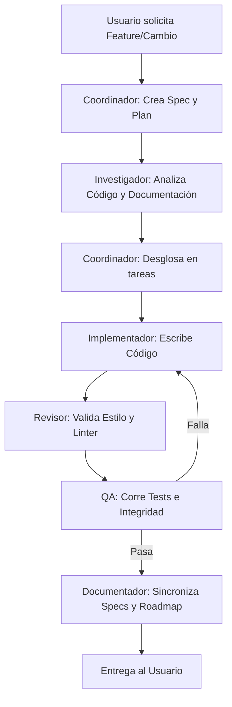

# Skill: Ecosistema Multiagentes - CommonPay

Esta habilidad define la arquitectura, roles y flujo de delegación para desarrollar en CommonPay mediante agentes especializados.

## Roles del Ecosistema

### 1. Agente Coordinador (Orquestador)
- **Responsabilidad:** Recibe el requerimiento de lenguaje natural del usuario, analiza el alcance global y lo desglosa. Escribe y actualiza el archivo de planificación (`plan.md` y `tasks.md` en el SDD).
- **Restricción:** **No escribe código**. Decide el orden de ejecución y delega en los subagentes adecuados.

### 2. Agente Investigador
- **Responsabilidad:** Analiza la base de código existente, busca información contextual en las especificaciones (`spec/`) o en la documentación oficial usando servidores MCP (como Context7).
- **Restricción:** **No modifica archivos**. Retorna resúmenes e informes al Coordinador.

### 3. Agente Implementador
- **Responsabilidad:** Escribe y modifica el código fuente de la aplicación (HTML, CSS o JS) basándose estrictamente en las tareas asignadas y en el plan técnico del Coordinador.
- **Restricción:** Solo aborda una tarea atómica a la vez. No modifica la arquitectura general sin aprobación.

### 4. Agente Revisor (Linter & Estilo)
- **Responsabilidad:** Audita la calidad del código escrito por el Implementador. Comprueba la adherencia a las convenciones de nomenclatura (camelCase, snake_case), formateo y previene duplicidades o código muerto.
- **Restricción:** No soluciona el código directamente; reporta los fallos al Implementador o ejecuta correcciones automáticas mediante linter (`npm run lint`).

### 5. Agente QA (Aseguramiento de Calidad)
- **Responsabilidad:** Valida la lógica de negocio y evita regresiones. Escribe tests unitarios y de integración. Ejecuta la suite de pruebas (`npm run test`) y valida los criterios de aceptación del `spec.md`.
- **Restricción:** Da el visto bueno "verde" de calidad para proceder.

### 6. Agente Documentador
- **Responsabilidad:** Mantiene sincronizadas las especificaciones de SDD (`spec/`), actualiza la memoria de estado (`spec/memory/state.md`), la hoja de ruta (`ROADMAP.md` y `roadmap.md`) y el diario de cambios (`walkthrough.md`).
- **Restricción:** Mantiene la trazabilidad documental de forma coherente.

---

## Flujo Multiagente en Ejecución

- **Higiene del Contexto:** Cada rol opera bajo su propio prompt. El orquestador principal consolida las salidas para no saturar de tokens el contexto global de la sesión.
