# Plan Técnico: 001 - Migración de Persistencia a Vercel Postgres

**Estado:** Aprobado  
**Fecha:** 2026-09-30  
**Arquitecto:** Antigravity

---

## 1. Arquitectura del Sistema

```mermaid
flowchart TD
    subgraph Cliente["Cliente PWA (Vanilla JS)"]
        UI[Interfaz & DOM / js/app.js]
        Storage[Capa de Almacenamiento / js/storage.js]
        Local[LocalStorage / Fallback Offline]
    end

    subgraph Backend["Vercel Serverless (Node.js)"]
        APIAuth["/api/auth.js (Login / JWT HMAC)"]
        APIData["/api/data.js (CRUD Seguro)"]
    end

    subgraph Database["Vercel Postgres (Neon Serverless)"]
        T1[(configuracion)]
        T2[(historial_meses)]
        T3[(fianza_historial)]
        T4[(conciliaciones)]
    end

    UI --> Storage
    Storage -->|Offline / Error| Local
    Storage -->|Login| APIAuth
    Storage -->|Lecturas / Escrituras| APIData
    APIData --> Database
```

---

## 2. Componentes y Módulos

### A. Dependencias Backend (`package.json`)
- Instalar `@vercel/postgres` en `dependencies` para permitir la comunicación serverless con el pool de conexiones de Postgres.
- Uso del módulo nativo de Node.js `crypto` para la generación y validación de tokens de sesión con HMAC SHA-256 (sin librerías externas pesadas).

### B. Funciones Serverless en `/api/`
1. **`/api/auth.js`**:
   - `action=login`: Compara la contraseña recibida con `process.env.EDITOR_PASSWORD` (o clave por defecto configurada). Genera token firmado `token:timestamp:signature`.
   - `action=check`: Valida la firma del token enviado en `Authorization: Bearer <token>` y comprueba expiración (30 días).
2. **`/api/data.js`**:
   - Inicialización automática: Ejecuta `CREATE TABLE IF NOT EXISTS` para las 4 tablas en la primera llamada.
   - Manejo de recursos:
     - `resource=config`: `GET` (público) / `POST` (protegido con token).
     - `resource=historial`: `GET` (público) / `POST` / `DELETE` (protegido).
     - `resource=fianza`: `GET` (público) / `POST` / `DELETE` (protegido).
     - `resource=conciliaciones`: `GET` (público) / `POST` / `DELETE` (protegido).

### C. Cliente Frontend (`js/storage.js`)
- Sustituir la inicialización de Supabase por llamadas directas a `/api/data` y `/api/auth`.
- Mantener las mismas interfaces públicas:
  - `getConfig()`, `saveConfig(config)`
  - `getHistorial()`, `addMesHistorial(mesData)`, `deleteMesHistorial(id)`
  - `getFianzaHistorial()`, `addMovimientoFianza(mov)`, `deleteMovimientoFianza(id)`
  - `getConciliaciones()`, `addConciliacion(con)`, `deleteConciliacion(id)`
  - `login(email, password)`, `logout()`, `obtenerUsuarioActivo()`
- Fallback automático a `LocalStorage` en caso de pérdida de conexión.

### D. Optimización de `index.html` y `vercel.json`
- Quitar ``.
- Eliminar `api/ping.js` y el bloque `crons` en `vercel.json` (ya no es necesario engañar a Supabase).

---

## 3. Plan de Verificación y Calidad
1. `npm run test`: Comprobar que los cálculos de negocio continúen pasando al 100%.
2. `npm run lint`: Verificar 0 errores de ESLint.
3. `npm run build`: Validar que Vite empaquete la distribución de producción limpiamente.
