# Plan Técnico: 002 - Input de Transferencia Real de Olga y Cálculo Dinámico

**Estado:** Aprobado  
**Fecha:** 2026-09-30  
**Arquitecto:** Antigravity (GitHub Spec Kit)

---

## 1. Arquitectura de la Solución

```mermaid
flowchart TD
    subgraph UI_Accion["Barra de Acción Inferior"]
        InputOlga["<input id='input-ingreso-olga'>\n(Ingreso Olga en €)"]
        BtnCompletar["<button id='btn-completar-mes'>\n(Transferencia realizada)"]
    end

    subgraph UI_Tarjeta["Tarjeta de Olga (Solo Lectura)"]
        CuotaOlga["Cuota Teórica Calculada\n(Hipoteca + Comunidad + Coche + Manutención + Extra)"]
        DetalleSuperavit["Detalle del Mes (En Vivo):\n'Ingreso del mes: X € • Superávit/Déficit: Y €'"]
        BadgeAcumulado["Badge Saldo Total Acumulado:\n'+Z €'"]
    end

    subgraph Estado_Logica["Motor de Negocio (js/app.js & js/calculations.js)"]
        EventoInput["Evento 'input' en tiempo real"]
        CalcSuperavit["calcularSuperavit(ingresoReal, cuotaTeorica)"]
        CompletarMes["completarMesActual()"]
    end

    subgraph Persistencia["Persistencia (Vercel Postgres & LocalStorage)"]
        DBConfig["configuracion (superávit acumulado)"]
        DBHistorial["historial_meses (transferenciaOlga real)"]
        DBFianza["fianza_estado / fianza_historial"]
    end

    InputOlga -->|Al teclear| EventoInput
    EventoInput --> CalcSuperavit
    CalcSuperavit --> DetalleSuperavit
    BtnCompletar -->|Click| CompletarMes
    CompletarMes --> DBConfig
    CompletarMes --> DBHistorial
    CompletarMes --> DBFianza
    DBConfig --> BadgeAcumulado
```



---

## 2. Modificaciones por Archivo

### A. `index.html`
- Añadir el contenedor `input-inline-wrapper` con la etiqueta `Ingreso Olga (€):` y el campo `<input id="input-ingreso-olga" type="number" step="0.01" min="0">` en el bloque de confirmación rápida `#dashboard-view`, ubicado junto a los botones `#btn-exportar-pdf-mes` y `#btn-completar-mes`.
- Estilizado Glassmorphism responsivo para que en pantallas móviles se acomode fluidamente con `flex-wrap: wrap`.

### B. `js/app.js`
1. **Referencias DOM y Listeners:**
   - Capturar `const inputIngresoOlga = document.getElementById('input-ingreso-olga');`.
   - Añadir listener `'input'` para disparar `actualizarCalculoSuperavitOlga()` en tiempo real.
2. **Función `actualizarCalculoSuperavitOlga()`:**
   - Lee el valor del input (parseado y validado).
   - Calcula el superávit/déficit mensual contra la cuota teórica del mes actual.
   - Actualiza el texto y color del contenedor `olgaSuperavitDetail` (`#10b981` para positivo, `#ef4444` para negativo).
   - Recalcula el "Dinero que debería haber en cuenta común" para reflejar la proyección en vivo.
3. **Función `actualizarInterfaz()`:**
   - Detecta si el mes actual ya está registrado en el historial:
     - Si está registrado: toma `registro.transferenciaOlga`, lo coloca en `inputIngresoOlga.value` y establece `inputIngresoOlga.disabled = true`.
     - Si no está registrado: habilita el input (si es Pedro), y si el input no ha sido tocado o cambia de mes, le asigna el valor por defecto configurado (`appConfig.gastosPersonales?.olga?.ingresoHabitual || 550.0`).
4. **Función `completarMesActual()`:**
   - Extrae el valor de `inputIngresoOlga`.
   - Valida que sea un número mayor que 0.
   - Aplica el superávit o déficit resultante al saldo acumulado con precisión centesimal:
     ```javascript
     const superavitAnteriorCents = Math.round((appConfig.gastosPersonales?.olga?.superavit || 0) * 100);
     const superavitMesCents = Math.round(superavitMes * 100);
     const nuevoSuperavit = (superavitAnteriorCents + superavitMesCents) / 100;
     ```
   - Ejecuta la aportación automática a la fianza hasta 450,00 €.
   - Registra en el historial con `transferenciaOlga: ingresoOlga`.

### C. `js/calculations.test.js`
- Añadir pruebas unitarias específicas para verificar:
  - Superávit con ingreso mayor que la cuota.
  - Déficit con ingreso menor que la cuota.
  - Saldo exacto con ingreso igual a la cuota.
  - Precisión de céntimos en redondeos flotantes extremos.

---

## 3. Plan de Verificación y Puertas de Calidad
1. `npm run test`: 100% de tests unitarios pasando.
2. `npm run lint`: 0 errores de ESLint.
3. `npm run build`: Compilación limpia con Vite.
